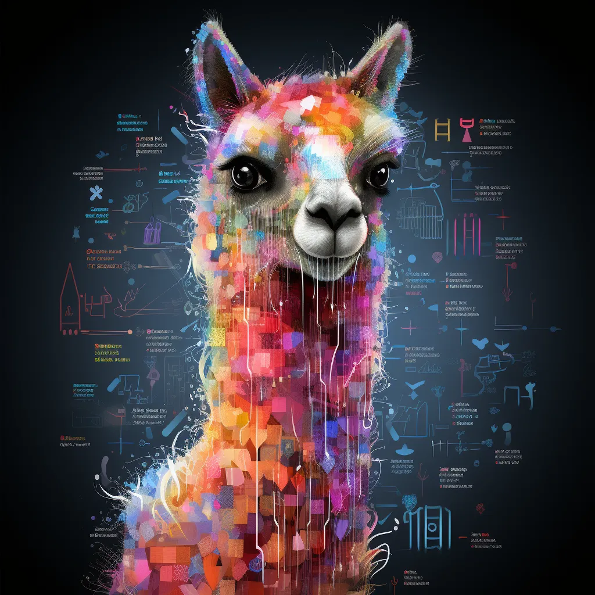

# Enhancing-LLM-with-Jenkins-Knowledge

<div align="center">
   
   <br>


</div>

<p align="center">
    <br>
</p>

<!-- <hr style="background-color: #4b4c60"></hr> -->


## Overview

<ul>
<li> Built using <a href="https://docs.python.org/3/">Python</a>.</li>
<li> This Project is from Google Summer of code 2024</li>

<br>

</ul>
</li>
</ul>

<!-- <hr style="background-color: #4b4c60"></hr> -->

<a id = "Env"></a>

## Setting up env

you may need to update the environment variables set in `BE/.env` and `FE/.env`

### Frontend env setup

- reach to `.env` file in `FE/` directory, you will find the url setup by default to localhost 

```sh
VITE_SERVER_URL = http://127.0.0.1:5000/
```

### Backend env setup

- reach to `.env` file in `BE/` directory, you will find also both  `HOST` and `PORT` which are configured to localhost be default

```sh
FLASK_RUN_HOST = 0.0.0.0
FLASK_RUN_PORT = 5000
```

<br/>
<!-- <hr style="background-color: #4b4c60"></hr> -->
<a id ="How To Run"></a>


## How To Run

Open a new terminal in the project directory

### Frontend server setup

- Need to install [Node](https://nodejs.org/en/download/package-manager) first
- Install all required packages

```sh
cd ./FE
npm install
```
- Start the server

```sh
npm run dev
```
- You will get a message that the server is running at http://localhost:5173/

### Backend server setup

- Install the <a href="https://github.com/nouralmulhem/Enhancing-LLM-with-Jenkins-Knowledge/tree/main/BE/requirements.txt">needed packages</a>.</li>

```sh
cd ./BE
python3 -m venv .
source ./bin/activate
pip install -r ./requirements.txt
```

- Start the server

```sh
python app.py
```

</br>
<!-- <hr style="background-color: #4b4c60"></hr> -->
<a id = "Fine-Tune"></a>

## Fine-Tune your version

You can fine-tune your own version and get it uploaded on hugging face using the following steps

- we fine-tune llama2 using colab free resources of T4 GPU with 16 GB VRAM
- we provided `./src/Fine-Tuning.ipynb` 
  - we clone our repository to access the dataset provided for training 
  ```sh
  git clone https://github.com/nouralmulhem/Enhancing-LLM-with-Jenkins-Knowledge.git
    ```

  - drive is used to store the checkpoints just to ensure its persistance in case of colab enviornment crashes
  
    you can edit the path to drive you want to save the model in by editting `new_model_path` variable

  - you also can set the number of epochs you would like to use to fine-tune the model by updating `num_train_epochs` variable

- after getting done with fine-tuning the model you can access `./src/Upload_Model.ipynb` to merge lora weights with the model and upload your own model on hugging face and start using it

  - at this stage you need to update `new_model_path` variable to the correct path on your drive

  - as a final step you need to update `repo_id` variable to match your repo on hugging face

VOILA! you got your own model

<br/>
<!-- <hr style="background-color: #4b4c60"></hr> -->
<a id ="GGML"></a>

## Convert fine-tuned to GGML

### CPU model

You can load this full model onto the GPU and run it like you would any other hugging face model, but we are here to take it to the next level of running this model on the CPU.

we are using llama.cpp, so first of all we need to clone the repo

```sh
git clone https://github.com/ggerganov/llama.cpp.git
```

Llama.cpp has a script called `convert_hf_to_gguf.py` that is used to convert models to the binary GGML format that can be loaded and run on CPU.

```sh
python convert_hf_to_gguf.py path/to/fine-tuned/model/  --outtype f16 --outfile path/to/binary/model.bin
```

This should output a 13GB binary file at the specified `path/to/binary/model.bin` that is ready to run on CPU with the same code that we started with!

### Quantization

Part of the appeal of the GGML library is being able to quantize this 13GB model into smaller models that can be run even faster. There is a tool called quantize in the Llama.cpp repo that can be used to convert the model to different quantization levels.

First you need to build the tools in the Llama.cpp repository.

```sh
cd llama.cpp
cmake -B build  
cmake --build build --config Release 
```

This will create the tools in the bin directory. You can now use the quantize tool to shrink our model to q8_0 by running:

```sh
cd build/bin/release
 llama-quantize.exe path/to/binary/model.bin path/to/binary/merged-q8_0.bin q8_0  
```
Now we have a 6.7 GB model at path/to/binary/merged-q8_0.bin


<br/>
<!-- <hr style="background-color: #4b4c60"></hr> -->
<a id ="Contributors"></a>


## Contributors

<table >
  <tr>
    <td align="center"><a href="https://github.com/nouralmulhem"><br /><sub><b>Nour Almulhem</b></sub></a><br /></td>
  </tr>
</table>

<br/>
<a id ="License"></a>

## 🔒 License

> **Note**: This software is licensed under MIT License, See [License](https://github.com/nouralmulhem/Enhancing-LLM-with-Jenkins-Knowledge/blob/main/LICENSE) for more information ©nouralmulhem.
